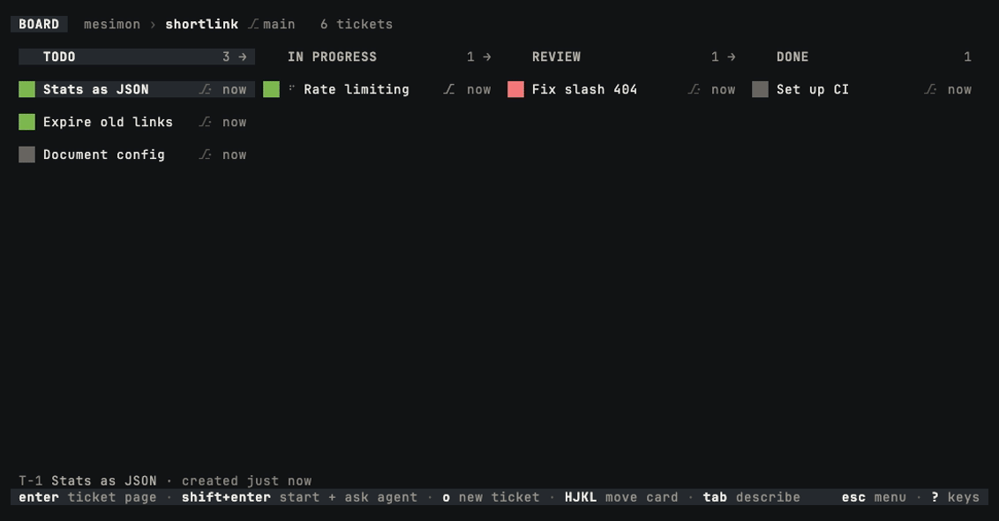

# mesimon

**mesimon** (Hebrew משימון, "the task instrument" — pronounced me-si-**MON**) is a terminal kanban
board that orchestrates many coding-agent sessions: like Kubernetes is to containers, mesimon is to
Claude Code and Codex. Tickets outlive sessions; columns carry policy; a per-repo
daemon keeps everything alive when the TUI closes.



<sub>Start an agent with Shift+Enter, answer it when its card lights, merge its branch with
`m`. Recorded with a scripted stand-in agent so the take is reproducible;
[`assets/demo/`](assets/demo) re-records it.</sub>

**Status: v0.1 alpha — early, and shared with a small group for feedback.** It runs, it is
dogfooded daily, and it will change under you. The current version and its history live in
[CHANGELOG.md](CHANGELOG.md); see [TESTING.md](TESTING.md) for what is useful to report.

Pictures can be pasted into a ticket note or new-ticket description with **Ctrl+V**
while the body is focused. Each appears as `[Image #N]`; save keeps the PNG with the
ticket, and the note's **Ctrl+K** links menu opens it in your desktop image viewer.
The ticket's agent can read pictures through `read_attachment`. Clipboard text still
pastes as text. Local macOS, X11, and Wayland desktops are supported (Wayland needs
clipboard data-control support); SSH and WSL image paste are not supported.
Pictures are limited to 10 MiB and 25 megapixels each, with 50 MiB of pending
pictures per draft. Discarding a draft discards its new pictures. Shared boards
currently synchronize the note text only: a picture absent on another machine is
reported as unavailable there.

## Three promises

1. **A strict write allowlist.** On its own, mesimon writes only to `.mesimon/`,
   `$GIT_DIR/info/exclude`, the git worktrees and `msmn/*` branches it created (and their git
   bookkeeping), its state dir under `~/.local/state/mesimon/`, and its runtime dir at
   `/tmp/mesimon-<uid>/<project key>/` — the sockets, provider observation snapshots/logs, the daemon lock, and the environment file
   every pane is launched with. That last one is a copy of your login shell's environment,
   secrets and all, so the runtime dir is 0700 and mesimon refuses it unless it owns it; those
   permissions are also the only thing between another user on this machine and the agent tool
   socket, because there is deliberately no token.

   Two more, each only when you ask for it:

   - **Remote-tracking refs and objects**, if you turn on periodic fetching
     (`MESIMON_GIT_FETCH=<minutes>`) or press *Fetch origin* in the Esc menu. That fetch never
     writes `FETCH_HEAD`, never runs `gc`, and never touches your branches.
   - **mesimon's own binary**, and the `mesimon-tmux` beside it where one exists, if you take an
     update offer. The download is checked against its published checksum first and refused
     without one.

   Never your shell rc, your git config, your `~/.claude/` or `~/.codex/` configuration, or your tmux config. Native agents still own their conversations and native trust decisions.
2. **No config mutation.** `mesimon doctor` diagnoses and prints copy-pasteable fixes. It has no
   `--fix`.
3. **Zero prompt injection.** mesimon adds, removes and reorders exactly zero tokens of your
   conversation. It never prepends a system prompt, never appends a reminder, never rewrites what
   you typed. When you ask it to start an agent on a ticket and submit (Shift+Enter), what it
   submits is the ticket's title followed by the ticket's description — both your own words,
   written for that ticket, and nothing of mesimon's.

   It does give the sessions it spawns scoped board tools — read and move its ticket, read and
   write its notes, tag it from the tags you already made, and file a new ticket — so an agent
   can see which ticket it is on and what it is about. One ticket per board can wear the
   *crown* (`^o` on its card): its agent may then move, retitle, tag, annotate, archive, set
   the workspace of and start an agent on the other tickets, each edit checked against the
   ticket as the agent last read it and lit on the card as it happens. Starts are capped by a
   per-board budget (Settings → Agents, three by default), and a ticket the crown started can
   never itself be crowned. Only you can crown a ticket; an agent that asks for it is told to
   ask you. `mesimon doctor --mcp` prints the current tool registry verbatim.


   And there is one line you can choose to add. The *agent brief* is off until you turn it on:
   a seven-line paragraph in the system prompt of the agent sessions mesimon starts in this repo
   — only those, never a session you started yourself — telling the agent to read its ticket
   before it starts work. The dialog that offers it shows the exact text first, `mesimon doctor`
   prints it, and *Settings › Agent brief* turns it off again. Together with the tool registry
   it is everything mesimon adds to model input.

## Requirements

- **macOS on Apple Silicon, or Linux on x86_64 / aarch64 — WSL2 included.** The published
  builds are `aarch64-apple-darwin` and a static-musl pair for Linux, so one binary runs on any
  distro. The code is Unix-only by design (unix sockets, tmux): on Windows, WSL2 is the way in,
  and keep the repo in the Linux filesystem, not under `/mnt/c` (`mesimon doctor` says so too).
- **git**. On macOS tmux is *not* required — mesimon ships its own, installed as `mesimon-tmux`
  so it never shadows yours. On Linux, install the distro's (`sudo apt install tmux`, 3.3 or
  newer; `mesimon doctor` names the floor).
- **Claude Code or Codex** on your `PATH`, authenticated through its native CLI.
  Codex runtime integration is tested against `codex-cli 0.153.4`; `mesimon doctor`
  reports installed versions and the measured compatibility boundary.

Choose the provider for new sessions in **Settings › Agents**. Claude Code is the
initial default. Switching providers leaves existing sessions, including sleeping
ones, with their original provider. Accepted queued starts keep their choice.
Each ticket has one live agent seat across both providers.

Follow-ups default to **Queue**: they wait for the current turn to end, including
approval and question stops. Choose **Steer** in **Settings › Behaviour › Follow-ups**
to send immediately by default, or toggle a composer with Shift+Tab. A queued
prompt appears on the ticket page; Ctrl+Y sends it now and Ctrl+U takes it back
for editing. Remote Control defaults to Queue and offers the same two actions.
The queue holds one prompt per ticket in memory; daemon restarts discard it.

## Install

```sh
curl -fsSL https://raw.githubusercontent.com/amitozalvo/mesimon-releases/main/install.sh | sh
mesimon doctor    # confirm the environment
```

Or with Homebrew, on macOS (Apple Silicon) or Linux:

```sh
brew install amitozalvo/tap/mesimon
```

The formula installs the same published binaries, and on macOS the same bundled tmux as
`mesimon-tmux`. Homebrew updates it: `brew upgrade mesimon`.

Binaries are published from
[amitozalvo/mesimon-releases](https://github.com/amitozalvo/mesimon-releases), a public repo that
carries releases and nothing else — so installing needs no GitHub account, no login, and no access
to this repo. `install.sh` verifies the checksum, runs the binary once before installing it, and
tells you exactly what to fix if anything is missing.

Working on mesimon itself? `cargo install --git https://github.com/amitozalvo/mesimon --locked
mesimon` (Rust 1.88+, and `CARGO_NET_GIT_FETCH_WITH_CLI=true` for the private fetch).

## Updating

**A board tells you.** Every half hour it asks the releases repo whether a newer version is out,
and when there is one the header says so: `◦ v0.1.0-alpha.5 available (esc)`. Esc opens the menu,
`Install v0.1.0-alpha.5` downloads it and checks it against the published checksum, and then the
offer becomes the one below — nothing restarts until you press `U`.

Nothing about that is automatic except the question. mesimon never installs a version you did not
ask for, and never restarts a board you did not tell it to.

**And it tells you what changed.** Esc → `Release notes` opens every version's notes, newest
first, with `this build` on the one you are running. They are the binary's own (`CHANGELOG.md`,
compiled in), so the page reads offline. Opening it also asks, right then, whether a newer version
is out; if one is, the header chip above appears.

**Or ask from a shell.** `mesimon update` checks now and, when a newer version is out, downloads
it, checks it against the published checksum and puts it in place of the binary you ran. It
restarts nothing: an open board offers `U`. `mesimon update --check` only asks.

- `MESIMON_NO_UPDATE_CHECK=1` turns the board's check off. `mesimon update` still works when you
  run it yourself. `mesimon doctor` prints whether the check is on, when it last answered and what
  it heard.
- Development builds never check. Only the binary `ci/release.sh` cuts is stamped to, so a
  `cargo build` board makes no request and can never have its binary replaced by a download.

**Installed with Homebrew?** Then `brew upgrade mesimon` updates it, and mesimon never replaces a
binary Homebrew installed. The board still says when a newer version is out; its menu row reads
`Upgrade to v0.1.0-alpha.5 with brew` and copies `brew upgrade mesimon` for you to run.
`mesimon update` prints the same command instead of downloading. After the upgrade an open board
offers `U`, as below.

**Or re-run the install line**, which is still the whole procedure and the only one on a machine
where the check is off.

- If a board is open, it notices the new binary and offers `update ready (U reloads)`. `U`
  restarts it in place.
- If no board is open, the next one you start notices that the background daemon is running older
  code and restarts it for you, before drawing anything. Your sessions survive: they live on the
  tmux server, which the daemon does not own.

## The first five minutes

```sh
cd <a git repo>
mesimon
```

On the board: `a` adds a ticket, `enter` opens it, `space` opens its page, `m` then `<`/`>` moves
it between columns, `p` peeks at a live pane, `q` quits.

`/` searches. Type any part of a ticket's title, its key, its column or a tag it wears and the
list narrows as you go; `ctrl-n` / `ctrl-p` walk it, `enter` puts the cursor on that card, `esc`
leaves the board where it was. Archived tickets are in the list, ranked under every live one and
marked; `tab` takes them out again.

In the new-ticket composer, `shift-tab` cycles between the shared checkout and a dedicated
worktree; that choice locks once a session exists. On a ticket page: `c` starts an agent session,
`s` a shell, and `enter` focuses a live one — that hands your whole terminal over. Detach with
`ctrl-]` (or `ctrl-5`) and you are back on the board. `v` shows the diff once there is a worktree,
and the merge flow lives on the identity line: fast-forward only, so mesimon never mints a merge
commit.

On Hebrew and other layouts that mirror the bracket keys, `ctrl-]` arrives as Esc — which
interrupts the agent instead of detaching. `ctrl-5` is bound for exactly that and works on any
layout; in iTerm2 you can also fix the keystroke itself, leaving Escape alone: Keys → Key
Bindings → `ctrl-]` → Send Hex Code → `0x1d`.

Every key is an English letter, so on a layout whose letters are not Latin (Hebrew, Russian,
Greek, Arabic) a letter pressed on the board is no key at all. mesimon pauses instead of
guessing: the footer names the layout, and every character key is ignored until you switch to
English and press a letter, which then acts. `esc` dismisses the pause. Arrows, `enter`, digits
and the `ctrl` keys keep working, and text fields take any language.

If `shift-enter` does nothing and `?` does not list it, the terminal never reported the key:
mesimon asks for it through the kitty keyboard protocol and leaves the key unbound where the
answer is no. On iTerm2 the usual cause is a key binding on Shift+Enter — Claude Code's
`/terminal-setup` installs one that sends a plain newline. Delete the `⇧↩` row under Keys → Key
Bindings and Profiles → Keys, then start mesimon again, in an iTerm2 tab rather than inside your
own tmux.

`tab` jumps to whatever needs you. The board is deliberately quiet — exactly one saturated colour
exists, and it means *this session is waiting on you*.

`x` parks a ticket's idle sessions and `X` parks every idle agent in DONE; the Esc menu archives
finished tickets and lists the archive. **Closing the board
does not stop your agents** — that is the point of the daemon.

**Settings › Agents › Sleep idle agents** optionally sleeps finished agent sessions after
15, 30, 60 or 120 idle minutes. It is off by default and applies to this board, even with the
TUI closed. The daemon checks every five minutes, measuring from when the turn finishes.
Running turns, background work and sessions needing attention stay awake. Wake resumes the
same conversation. The board's `park_after_minutes` setting accepts any whole number of
minutes; `0` disables it.

**Settings › Behaviour › Keep this machine awake** prevents sleep while an agent works,
including while you are attached to its pane. It is off by default. While enabled, a fixed-width
indicator beside the board's ticket count shows emoji-style `☕️` when preventing sleep and a dimmed crescent `☾`
when enabled but idle (`@` / `z` in ASCII mode).
The indicator disappears when the setting is disabled; activity changes do not shift the title.
From a column header, press Up / `k` to reach the board header, then Right / `l` to select
the indicator beside the ticket count. Enter opens its setting, selected and ready to toggle.
Left / `h` returns to repository status; Down / `j` returns to the column.
A turn waiting for user action releases the hold, as does closing the board.
On macOS the display and closed-lid behavior are unchanged. Linux requires `systemd-inhibit`;
its sleep lock can also block explicit suspend requests, depending on desktop policy.
`mesimon doctor` describes the available backend. WSL support remains opt-in and unverified.

`MESIMON_CAFFEINATE=off` overrides the setting. `MESIMON_CAFFEINATE=caffeinate` (or its absolute
path) uses a guarded macOS subprocess. Any other custom program named by this variable must
release its hold and terminate its children on stdin EOF; that contract is necessary for
cleanup after Mesimon is killed.

The footer always names the keys for whatever you are looking at; `?` opens the complete key
reference for the current screen.

## What your agents can see

An agent session mesimon starts gets the scoped board tools shown by `mesimon doctor --mcp`, so it
knows which ticket it is on, can read the ticket's description and notes, write notes of its own,
move its own card, put one of your tags on it, and file a new ticket for work it found outside its
scope (the new card has no session; you decide what happens to it). The tags are yours: an agent
picks from the ones you made in the picker and cannot add, rename, recolour or delete one.
They arrive on the command line and are installed nowhere: no `.mcp.json`, no `~/.claude.json`,
no `settings.local.json`, no plugin. A session you start yourself never sees them, and your own
MCP servers still load alongside.

There is no tool, at any tier, to spawn or kill a session, delete or archive or rename a ticket,
merge a branch, or read a session, a transcript or a cost. Those commands are refused by the
daemon, not merely absent from the tool list.

Claude's `Edit`/`Write` and Codex's structured `apply_patch` writes into `.mesimon/` and mesimon's state directory are refused too —
which is why a note, a markdown file under `.mesimon/`, reaches an agent through a tool and not
through `Write`; the tool stamps who wrote it. Its shell is not: `sed -i` into those paths still
works, because matching on command strings is security theatre and hooking every `Bash` call
would tax the one thing agents do constantly.

`mesimon doctor --mcp` prints all of it — the exact flag, every tool description, the token cost,
and what mesimon deliberately does not send.

## Stopping everything

Agent sessions cost real tokens and keep running after the board closes. To stop all of them for a
repo:

```sh
mesimon doctor                     # shows the daemon and the project key
pkill -f "mesimon daemon"          # stops the daemon (sessions survive this)
tmux -S /tmp/mesimon-$(id -u)/<project key>/tmux.sock kill-server   # stops the agents
```

Inside the board, `X` parks every idle agent in DONE, which is the gentler version.

## What mesimon writes

| Path | What |
|---|---|
| `<repo>/.mesimon/` | Your board: columns, tickets, and durable content-import receipts/staging under `board/imports/`. Excluded via `$GIT_DIR/info/exclude`, never `.gitignore`. |
| `$GIT_DIR/info/exclude` | One line, so `.mesimon/` does not show up in `git status`. |
| `~/.local/state/mesimon/<project key>/` | Sessions, worktrees, hook settings, provider launch settings, normalized previews, logs, and the private tmux server's conf. (Its socket is in the runtime dir below.) |
| `~/.local/state/mesimon/notifications/` | Notification mascot images and signed Mesimon copies of the installed macOS notification helper. |
| `~/.local/state/mesimon/team/` | Board sharing: this machine's identity on the relay (`device.toml`), and the roots of team boards you joined without a checkout, under `boards/`. Only after you sign in. |
| `~/.local/state/mesimon/update-check.json` | When the release check last answered, and what it heard. One per machine, not per repo. |
| `~/.local/state/mesimon/prefs.json` | Your theme picks, one for a dark terminal and one for a light one. One per machine, not per repo. |
| `/tmp/mesimon-<uid>/<project key>/` | The daemon, hook and private-tmux sockets, the daemon lock, and the environment file panes are launched with. 0700, because that file holds your shell's environment. Gone on reboot. |
| Worktrees and `msmn/*` branches | Only ones it created, only for tickets you set to worktree mode. |
| mesimon's own binary | Replaced in place, only if you take an update offer, only after its published checksum verifies. |

Nothing else. If you ever find mesimon writing outside that list, that is a bug worth reporting
above all others.

The Teams relay is a separate server binary, in its own repository, with its own
database; nothing in this list is written by it, and nothing it stores is
readable to it.

## Investigating agent state

`mesimon state explain [session-prefix] --repo <repo>` shows the current state,
confidence, recent inference decisions and board-movement decisions. The
compatibility manifests it ran against are `docs/claude-compatibility.json` and
`docs/codex-compatibility.json`.

## Layout

- `crates/` — the Rust workspace.
- `docs/` — `STALE-MAP.md`, the design record (what was built, and why), `ARCHITECTURE.md`, the
  agent-state scenario fixtures and the compatibility manifests. The code is the spec.
- `web/mesophon` — the Remote Control browser client.
- The paid Teams relay is a separate, private repository; `crates/mesimon-team` is its Apache
  client.

## License

Apache-2.0. See `LICENSE`, `NOTICE`, and `TRADEMARK.md`.

## Remote Control browser preview

Remote Control (Mesophon) lets your own browser **view tickets, preview an agent’s
output, send a prompt, and answer supported Claude dialogs**. It works on desktop and phone.
Debug builds include Remote Control automatically. In release builds, set
`MESIMON_MESOPHON=1` when starting Mesimon. Open **Esc → Sharing → Remote Control**, sign in to
your relay, and enable this board. Choose **Pair a browser**, open the displayed
browser address, and enter its single-use code within ten minutes.

Each board requires explicit enablement and pairing, including private boards.
Enabling Remote Control does not share a board with teammates. The host must stay awake
and its board daemon must be running. This preview does not yet provide board
editing, agent start/stop, interactive terminals, or starting stopped daemons.
For a browser on this Mac, set the relay’s `WEB_ORIGIN=http://localhost:8444`
and publish port 8444 on loopback only. Run `mesimon mesophon setup` to check the
connection and open the browser; there is no certificate or Keychain setup.
`mesimon mesophon setup --check` checks without opening a browser. A phone or
another computer needs a reachable HTTPS relay with a browser-trusted certificate;
`localhost` always means the device running the browser. The relay's deployment
guide ships with the relay.

A prompt targets the session shown when you send it. **Submitted** means delivery
to the agent’s input, not completion of its work. Waiting Codex prompts retain the
paired device’s authority and are cancelled if access is revoked or the target
changes. Reconnects never resubmit prompts automatically. If a delivery result
cannot be recovered, the browser shows **outcome unknown**; check the agent before
sending again. Prompt text is limited to 4096 UTF-8 bytes; previews show the last
50 lines, and oversized responses are rejected.

Claude permission requests can be approved once or denied while their remote
window is open. Claude’s local dialog remains available while the hook waits;
unanswered requests leave its native permission flow unchanged.
The write-protection gate remains deny-only; remote approval never installs rules
or changes the permission mode. Existing sessions need refreshed hook settings
before they offer remote approvals.

Single-choice questions, single-line free-text answers, and plan accept/reject
use verified native dialog selections. Plans are accepted with manual edit
approval. Unrecognized, multiple-question, and multi-select forms require a local
answer; uncertain delivery is never retried automatically. “Decision sent” and
“Answer keys sent” confirm transport, not tool execution or completion.

Connected-browser alerts carry encrypted per-ticket phase changes. They never
announce completion on prompt submission and are silenced while a paired browser
is foregrounded on that ticket. Updates appear in the page with a ticket link.
Enable optional system notifications through
**Enable connected-browser alerts**. This version requires the browser to remain
connected; it does not provide closed-browser Web Push or mobile live activities.
Older M1 hosts remain usable through capability negotiation.

Select a paired device in the Remote Control dialog and press Enter twice to revoke it.
Disabling Remote Control removes every grant for this board; re-enabling requires new
pairing. **Forget this device** removes the browser’s local identity and remembered
boards; revoke on the host to remove the corresponding grants too.

The daemon stores `mesophon.json` (mode 0600) in its existing per-board state
directory, containing only the opaque board identity and device grants. Pairing
secrets and delivery receipts live in memory. The browser stores device keys,
credentials, and remembered grants in IndexedDB; ticket content, output, and unsent
text remain in memory. The relay routes encrypted content and stores only routing
metadata for Mesophon. Browser assets are served by the relay, so the relay’s web
deployment is part of the browser client’s trust boundary.
