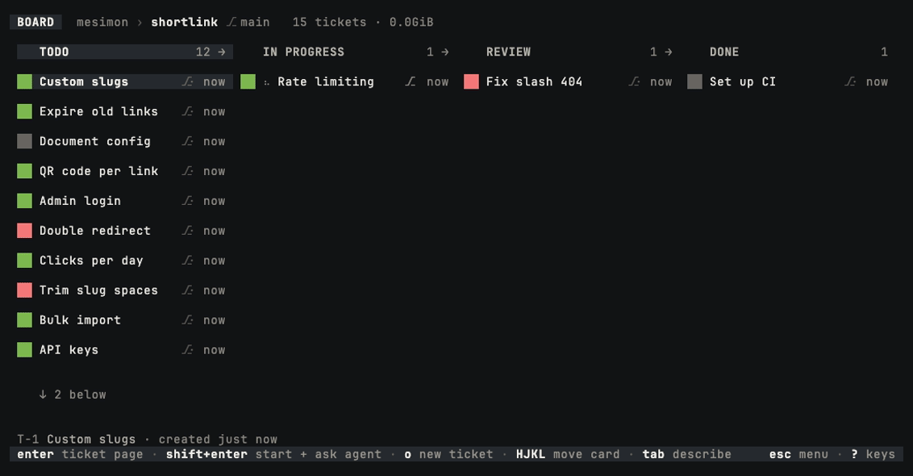
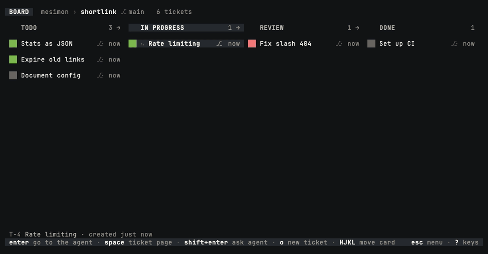
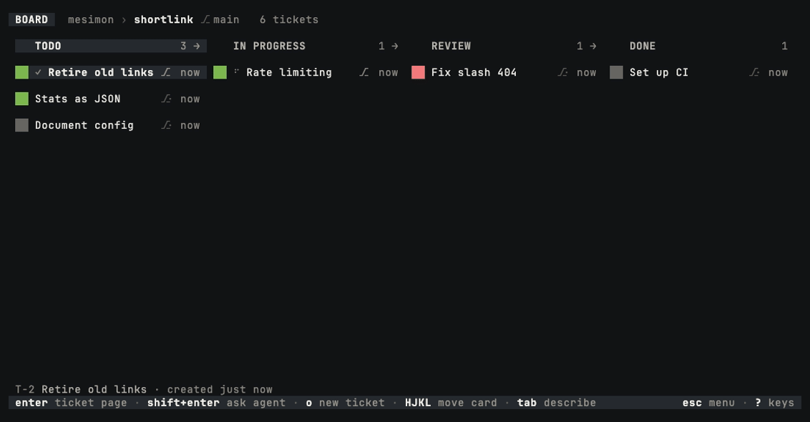
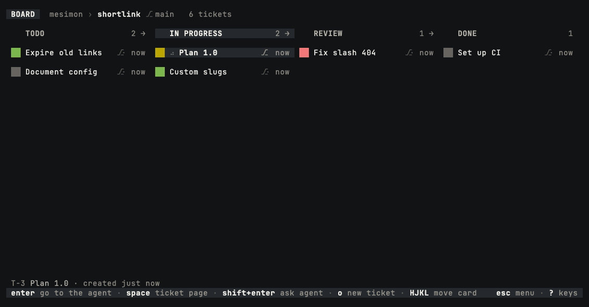

# Using mesimon

The [README](../README.md) gets you to a first agent. This page is the rest.

- [Requirements](#requirements)
- [Installing](#installing)
- [Updating](#updating)
- [On the board](#on-the-board)
- [Descriptions, notes and links](#descriptions-notes-and-links)
- [Keyboard layouts and terminals](#keyboard-layouts-and-terminals)
- [Agents and follow-ups](#agents-and-follow-ups)
- [Sleeping idle agents](#sleeping-idle-agents)
- [Keeping the machine awake](#keeping-the-machine-awake)
- [Pictures in notes](#pictures-in-notes)
- [What your agents can see](#what-your-agents-can-see)
- [Stopping everything](#stopping-everything)
- [Investigating agent state](#investigating-agent-state)

## Requirements

- **macOS on Apple Silicon, or Linux on x86_64 / aarch64 — WSL2 included.** The published
  builds are `aarch64-apple-darwin` and a static-musl pair for Linux, so one binary runs on any
  distro. The code is Unix-only by design (unix sockets, tmux): on Windows, WSL2 is the way in,
  and keep the repo in the Linux filesystem, not under `/mnt/c` (`mesimon doctor` says so too).
- **git**. On macOS tmux is *not* required — mesimon ships its own, installed as `mesimon-tmux`
  so it never shadows yours. On Linux, install the distro's (`sudo apt install tmux`, 3.3 or
  newer; `mesimon doctor` names the floor).
- **On macOS, one permission prompt.** The first agent you start asks whether `mesimon-tmux`
  may access the folder your repository is in, when that is Documents, Desktop or Downloads.
  Allow it: the private tmux server then keeps that access after the terminal that opened the
  board has quit. If it is ever refused, `mesimon doctor` says so on its `private server`
  line, and the board's Esc menu offers to restart the server.
- **Claude Code or Codex** on your `PATH`, authenticated through its native CLI.
  Codex runtime integration is tested against `codex-cli 0.153.4`; `mesimon doctor`
  reports installed versions and the measured compatibility boundary.

## Installing

```sh
curl -fsSL https://mesimon.dev/install.sh | sh
mesimon doctor    # confirm the environment
```

Or with Homebrew, on macOS (Apple Silicon) or Linux:

```sh
brew install amitozalvo/tap/mesimon
```

The formula installs the same published binaries, and on macOS the same bundled tmux as
`mesimon-tmux`. Homebrew updates it: `brew upgrade mesimon`.

Binaries are published from
[amitozalvo/mesimon-releases](https://github.com/amitozalvo/mesimon-releases), a public repo that
carries releases and nothing else — so installing needs no GitHub account and no login.
`install.sh` verifies the checksum, runs the binary once before installing it, and tells you
exactly what to fix if anything is missing.

Working on mesimon itself? `cargo install --git https://github.com/amitozalvo/mesimon --locked
mesimon` builds it from source (Rust 1.88+).

## Updating

**A board tells you.** Every half hour it asks the releases repo whether a newer version is out,
and when there is one the header says so: `◦ v0.1.0-alpha.5 available (esc)`. Esc opens the menu,
`Install v0.1.0-alpha.5` downloads it and checks it against the published checksum, and then the
offer becomes the one below — nothing restarts until you press `U`.

Nothing about that is automatic except the question. mesimon never installs a version you did not
ask for, and never restarts a board you did not tell it to.

**And it tells you what changed.** Esc → `Release notes` opens every version's notes, newest
first, with `this build` on the one you are running. They are the binary's own (`CHANGELOG.md`,
compiled in), so the page reads offline. Opening it also asks, right then, whether a newer version
is out; if one is, the header chip above appears.

**Or ask from a shell.** `mesimon update` checks now and, when a newer version is out, downloads
it, checks it against the published checksum and puts it in place of the binary you ran. It
restarts nothing: an open board offers `U`. `mesimon update --check` only asks.

- `MESIMON_NO_UPDATE_CHECK=1` turns the board's check off. `mesimon update` still works when you
  run it yourself. `mesimon doctor` prints whether the check is on, when it last answered and what
  it heard.
- Development builds never check. Only the binary `ci/release.sh` cuts is stamped to, so a
  `cargo build` board makes no request and can never have its binary replaced by a download.

**Installed with Homebrew?** Then `brew upgrade mesimon` updates it, and mesimon never replaces a
binary Homebrew installed. The board still says when a newer version is out; its menu row reads
`Upgrade to v0.1.0-alpha.5 with brew` and copies `brew upgrade mesimon` for you to run.
`mesimon update` prints the same command instead of downloading. After the upgrade an open board
offers `U`, as below.

**Or re-run the install line**, which is still the whole procedure and the only one on a machine
where the check is off.

- If a board is open, it notices the new binary and shows `◦ update ready (U ∙ esc)`. `U`
  restarts it in place.
- If no board is open, the next one you start notices that the background daemon is running older
  code and restarts it for you, before drawing anything. Your sessions survive: they live on the
  tmux server, which the daemon does not own.

## On the board

```sh
cd <a git repo>
mesimon
```

On the board: `o` adds a ticket, `space` opens its page, `enter` goes to its agent (or opens the
page when it has none), `HJKL` moves the card (`>` or `<` twice does too), `p` shows each agent's
latest reply under its card, `q` quits.

`/` searches. Type any part of a ticket's title, its key, its column or a tag it wears and the
list narrows as you go; `ctrl-n` / `ctrl-p` walk it, `enter` puts the cursor on that card, `esc`
leaves the board where it was. Archived tickets are in the list, ranked under every live one and
marked; `tab` takes them out again.



<sub>Three letters narrow fifteen tickets to one, and `enter` scrolls the board to its card.</sub>

In the new-ticket composer, `shift-tab` cycles between the shared checkout and a dedicated
worktree; that choice locks once a session exists. On the board or a ticket page, `c` copies the
ticket's id; press it again for the title, and a third time for the id and title together. On a
ticket page: `enter` on `+ agent session` starts an agent session and on a sleeping one wakes it,
`!` opens a terminal in the ticket's worktree or checkout, and `enter` steps into a live session:
its own terminal takes over your whole screen. `ctrl-]` (or `ctrl-5`) steps back out to where you
were. `v` shows the diff once there is a worktree, and `m` on the branch line merges it:
fast-forward only, so mesimon never mints a merge commit. A second `m` tells the agent its branch
was merged; for an agent the crown started, the board tells it in the same step (where **Auto
merge tells the agent after a merge** is on), the line reads `merged ∙ its agent was told`, and
there is no second press. `m` on a card on the board opens the same dialog for that ticket, and
its answers appear in the status line.

A worktree starts cold: a fresh checkout with no build cache and no installed dependencies, so
the first thing its agent does is wait for a build. To start it warm, put a script named
`.mesimon-worktree-init.sh` at the repository root. mesimon runs it once in each new worktree,
before the ticket's agent starts, in your login shell's environment, with `MESIMON_CHECKOUT`
naming your checkout and `MESIMON_WORKTREE` the new worktree, which is also its working
directory. Executable, it runs as it is, so any language with a shebang works; otherwise it runs
under `sh`. It is read from your checkout, so you can try it before you commit it; committed, it
reaches every clone. mesimon never creates it and never changes it. A failure never holds the
agent back: the ticket page reads `init failed ∙ exit 2` beside the branch, the activity feed
keeps the exit code and the time it took, and the daemon journal keeps what it printed. Ten
minutes is the limit. The script is yours and runs as you, the same trust as a build script or a
package's install hook; on a workspace of several repositories it runs in each one that has a
script. An agent reads whether the repository has one and how the last run went on its own
ticket, so an agent asked to make tickets start faster knows where to look. The script is
whatever your stack needs:

```sh
# Rust on macOS: clone the warm build directory. APFS copies on write, so
# this takes seconds and no space until a file changes.
cp -c -R "$MESIMON_CHECKOUT/target" target

# Node: install, or share the checkout's modules.
npm ci
ln -s "$MESIMON_CHECKOUT/node_modules" node_modules

# Python
uv sync

# Anything
make dev
```

What you step into is the agent itself: Claude Code or Codex exactly as you run it without
mesimon, with the same prompt, the same slash commands and the same permission dialogs. Type to
it, answer its questions, interrupt it: mesimon never sits between you and it.



<sub>`enter` steps into the agent's own terminal, where you type to it as you always do, and
`ctrl-]` steps back out while it keeps working.</sub>

The board is deliberately quiet — exactly one saturated colour exists, and it means *this
session is waiting on you*.

`x` sleeps a ticket's sessions and wakes them again. When finished agents sit idle in DONE, `X`
sleeps them all. The Esc menu archives finished tickets and lists the archive. A ticket whose
`Summary` still has an unticked box is not finished: it is never offered and cannot be archived
until the box is ticked or taken out. **Closing the board
does not stop your agents** — that is the point of the daemon.

The footer names the main keys for whatever you are looking at; `?` opens the complete key
reference for the current screen.

## Descriptions, notes and links



<sub>`tab` adds two lines to the brief, `enter` opens the page with the note its agent left, and
`ctrl-k` opens one of that note's links.</sub>

`tab` on a card opens its description, the brief its agent starts from. `ctrl-s` saves it and
closes the editor, and `ctrl-g` opens the text in your own editor instead. The description is a
ticket's first note. Every other note is listed under NOTES on the ticket page, whether you
wrote it with `N` or the ticket's agent wrote it; `j` and `k` walk down to a note and show it.
Notes are markdown.

`ctrl-k`, on the board or on a ticket page, lists every link in the ticket's notes and in its
agent's latest reply: web addresses, files in the ticket's worktree or checkout (with a line
number when one is written), other tickets, and pasted pictures. `enter` opens one: a web
address in your browser, a text file in your editor, another ticket by moving to it. `c` copies
it instead.

A note section headed `Summary` is the ticket's checklist. Write it in the description or let the
agent write it in a note of its own:

```markdown
## Summary
redirect fixed; e2e next
- [x] rewrite the redirect to keep the return path
- [ ] add the e2e for the return path
- [ ] release note
```

Only what sits under that heading counts, so an agent's working list under any other heading
stays in the note. The agent reads the same rows, ticked or not, in `get_ticket`'s answer, with a
line that says what the heading does, so "put a checklist on the ticket" needs no explaining. On the board the card wears the boxes as an underline, as far along as they
are ticked; with the replies shown (`p`) the cursor card lists the open boxes under the
reply, and a line with no box is read first, as the one-line summary. `ctrl-j`, on the board or on
a ticket page, lists every row: `space` ticks or unticks a box, `enter` opens a link in the line (a web address first) or, without one, the note at that
line, `a` (or `shift+enter`) opens the ask field with the line quoted so you can ask the agent
about it, and `c` copies it. A tick is refused when the agent rewrote the note since the dialog
read it; open the dialog again. A change to the boxes, yours or the agent's, sweeps across the
card's underline; a tick that finishes the list sweeps it twice. Settings › Appearance ›
`Summary on cards` chooses how much the cards show: `full` is the underline and the rows,
`hover` the rows under the selected card only, `none` nothing on the cards (`ctrl-j` still
lists it).

## Filing a ticket from a script

`mesimon ticket create` puts a card on a board from the shell, the way the composer does, and
prints its key:

```sh
mesimon ticket create --repo ~/code/app --column TODO --title "Flaky login test" \
  --note "https://example.slack.com/archives/C024BE91L/p1700000000000100"
```

`--repo` is the repository the board belongs to (default: the current directory), `--column`
one of its columns, `--note` the description (`-` reads it from stdin) and `--tag` a tag the
board already has, repeated for more than one. The board's daemon is started when none is
running, so the ticket lands with the board closed, and a refusal (a column or tag the board
lacks) files nothing. mesimon ends there: a Slack command, a launcher or a git hook that calls
it is yours. Two things are worth knowing when you wire one up. If the crown runs your board, a
ticket it finds waiting may get an agent, so land the ticket in a column the crown leaves alone
when you want it to wait for you. And put a link in the note rather than a message's text: an
agent reads the description as its brief, and anyone who can write in that channel would be
writing it.

## Keyboard layouts and terminals

On Hebrew and other layouts that mirror the bracket keys, `ctrl-]` arrives as Esc — which
interrupts the agent instead of detaching. `ctrl-5` is bound for exactly that and works on any
layout; in iTerm2 you can also fix the keystroke itself, leaving Escape alone: Keys → Key
Bindings → `ctrl-]` → Send Hex Code → `0x1d`.

Every key is an English letter, so on a layout whose letters are not Latin (Hebrew, Russian,
Greek, Arabic) a letter pressed on the board is no key at all. mesimon pauses instead of
guessing: the footer names the layout, and every character key is ignored until you switch to
English and press a letter, which then acts. `esc` dismisses the pause. Arrows, `enter`, digits
and the `ctrl` keys keep working, and text fields take any language.

If `shift-enter` does nothing and `?` does not list it, the terminal never reported the key:
mesimon asks for it through the kitty keyboard protocol and leaves the key unbound where the
answer is no. On iTerm2 the usual cause is a key binding on Shift+Enter — Claude Code's
`/terminal-setup` installs one that sends a plain newline. Delete the `⇧↩` row under Keys → Key
Bindings and Profiles → Keys, then start mesimon again, in an iTerm2 tab rather than inside your
own tmux.

## The mouse

The board reads the mouse. A click on a menu or list row is that row's `enter`: it opens,
toggles or chooses at once (a row that asks for `enter` twice still does; the External drawer
only moves to the row). A click puts the cursor on a card, a column's header, a rail row, a tag
or a file, and a click on the one the cursor is already on acts on it, so a double-click opens a
card's page or focuses a session. A key hint is a
button: `? keys` in the footer opens the key list, `enter` on a dialog's edge presses Enter. A
click outside a dialog closes it, the way `esc` does: the note editor asks first when it holds
unsaved text, and a field being typed into (a column's name, a tag's) keeps the dialog open. The wheel walks the column or list under the pointer, and scrolls the
ticket page's preview, the diff and the release notes. Whatever the pointer is over lights up.

In a title, a note or any field being typed in, a click puts the text cursor where you
clicked. Drag to select text: the selection is copied when you let go, and the footer says so. A
click acts when the button comes up, so the press that starts a drag presses nothing. The
terminal's own selection still works with a modifier held: `⌥` (Option) in iTerm2, `shift` in
most others. Settings › Behaviour › `Mouse` turns the mouse off and gives the terminal its
selection back.

Rest the pointer on a card for a moment and it opens with its latest reply, the way `p` opens
the selected card; the cards below move down. It stays open until the pointer rests on
something else, and any key closes it.

## Agents and follow-ups

Choose the provider for new sessions with **Settings › Agents › Default tier**: `claude` runs
Claude Code and `codex` runs Codex. Claude Code is the initial default. Switching providers
leaves existing sessions, including sleeping ones, with their original provider. Accepted queued
starts keep their choice.
Each ticket has one live agent seat across both providers.
Where Claude Code is 2.1.287 or newer, mesimon loads its own mod into each Claude session it
starts, in place of the hooks and the MCP server it generates for an older one; `mesimon doctor`
says which of the two a session got. The mod reports the session's events to the board, refuses
its writes to the board's files and serves its board tools. On a Team or Enterprise account,
Claude Code keeps its hook events from a person's plugins, so the mod there reports the session
from Claude Code's own events instead, and one hook beside it reports permission requests;
`mesimon doctor` says so, and nothing is needed from you.
Through the mod, a session gets its brief and every prompt you send it as your own words, whole,
without anything typed into its pane, and a question it asks is answered straight in its dialog
when you answer from Remote Control or the crown does. A session without the mod has its prompts
typed and its dialogs keyed, as on an older Claude Code. A plan is still accepted by a press on
its dialog either way.

Follow-ups default to **Queue**: they wait for the current turn to end, including
approval stops. A question holds them instead: words queued before or while the agent asks one
wait for your answer and then your Ctrl+Y (`agent asked ∙ you send`), and an ask behind another
ticket's question says so (`queued ∙ after T-3's answer`). Choose **Steer** in
**Settings › Behaviour › Follow-ups** to send now by default, or cycle a composer with
Shift+Tab: `now`, `queued`, and on a Claude agent `immediately`. Sent `now`, a working agent
reads your words at its next step (on the mod road, after its turn ends). Sent `immediately`,
mesimon puts them in Claude Code's prompt box and presses its send-now (Ctrl+X Ctrl+S), so a
working agent reads them before its running command ends. That command keeps running in the
background, and the turn goes on. On the mod road a draft you are typing in the agent's own
prompt box is never replaced: the words are then sent `now` instead. A queued prompt appears on
the ticket page; Ctrl+Y sends it now and Ctrl+U takes it back for editing. Remote Control
defaults to Queue and offers the same two actions.
The queue holds one prompt per ticket in memory; daemon restarts discard it.

## The crown: one agent runs the board

Press `ctrl-o` on a ticket to crown it. Its agent can then work on every other ticket through its
board tools: move, retitle and tag them, write their notes, set their workspace, start an agent on
one, and leave words for another ticket's agent, which wait on that card until you send them. It
archives a ticket only where you let it (**Crown archives tickets**, below); otherwise it moves a
finished ticket to DONE and you archive it. It watches a ticket you started only where you let it
(**Crown watches tickets**, below). Each edit is checked against the ticket as the agent last read it, and the card it lands on
lights with what was done (`♛ moved`, `♛ tagged`, `♛ started`). One ticket wears the crown at a
time. Only you can give it, and `ctrl-o` on the crowned card takes it back.



<sub>The crowned agent files two tickets, moves one back to TODO, tags one and starts an agent
on another; the moved, tagged and started cards light as they change.</sub>

You can watch the crown work without opening its session. Each action strikes: a bolt of
lightning runs from the crowned card's `♛` to the card it acted on, and the word for what was
done arrives with it. The title lights from where the bolt lands. A card the crown moved stays
as a faint ghost in the place it left while the bolt runs through it, so you see the column it
came from as well as the one it went to. An agent the crown put to
sleep dims its title for a moment, a ticket the crown filed writes its title in, and a ticket
it archived burns away before its column closes up. When an agent it started reports back, a
bolt runs the other way, from that card to the crown. **Settings › Appearance › Crown's
actions** turns the lightning off for this machine; the card still says what was done.

**Settings › Agents › Crown mode** is autonomous by default; supervised keeps the crown's words,
and every question and plan, for you. Autonomous lets the crown's words go without your `^y` to an
agent the crown started, and lets the crown answer a question, and accept a plan, that such an
agent stops on. Its words reach that agent by the queue once the agent is idle, the card lights
`♛ sent`, and the activity feed records the send as the agent's. Words that would wake a sleeping
agent need a free seat in the crown's budget and hold it while they wait. The crown can also send
its words `now` or `immediately`, as your Shift+Enter does with the send set to either: they reach
a working agent at once instead of waiting for it to go idle. It cannot send them that way while
the agent is at a dialog. A question from such an agent wakes the crown, which reads it on the
agent's ticket and may pick one of its options, tick several where the question takes several, or
type a one-line answer in their place, through the same screen-checked road as Remote Control's
question card. A dialog that asks several questions at once is answered whole, one answer per
question, because Claude Code submits them together. The card lights `♛ answered` and reads
`answered by T-411: Okta` while the agent works on the answer (several answers are joined by `;`),
and the activity feed records the answer as the agent's. Words for an agent you started, and every
question or plan from one, wait for you under either mode, and so does a permission, a secret or a
form. mesimon does not read the question to decide. The crown is told that a question about
secrets or credentials, spend or quota, something destructive or irreversible (deleting,
force-pushing, publishing, sending to people), a preference its brief leaves open, or anything
beyond the brief is yours, and that one such question in a batch makes the whole batch yours, and
to raise its hand on its own card for it. If you answer first, the crown's answer is refused.
Switching to supervised, or taking the crown back, holds whatever words had not gone yet on their
card. Where its words are held for you, the ask opens at the level the crown chose when you edit
it, and `^y` sends it at that level.

A plan an agent the crown started stops on wakes the crown too. The crown reads the plan on that
agent's ticket and may accept it the way the board's own accept does: one Enter on the plan
dialog's first row, only once the screen shows the dialog with the cursor there, and only while
no other agent is working in the same checkout. The card lights `♛ accepted plan` and reads `plan
accepted by T-411` while the agent works on the plan, and the activity feed records the accept as
the agent's. The crown is told that a plan it would change, or one that reaches past its brief,
is yours: it raises its hand on its own card, and you answer the dialog. If you answer first, the
crown presses nothing.

**Settings › Agents › Crown archives tickets** (off by default) lets the crown archive a ticket and
restore an archived one. While it is off, the crown is refused in words that name this row, and it
moves a finished ticket to DONE instead; you decide when the card leaves the board and when its
merged worktree is reclaimed. Turned off, it holds from the crown's next call.

**Settings › Agents › Crown watches tickets** (off by default) lets the crown watch a ticket you
started yourself. The board then wakes the crown for that ticket as it does for the agents the
crown started: when it delivers, finishes a turn, raises its hand or is merged, one sentence
saying so is sent into the crown's session, and the watch ends at the merge. Nothing is sent to
that ticket's agent, which stays yours: its questions and plans wait for you, and the crown
cannot answer, park or merge it. Tell the crown to wait for a ticket and it watches that ticket
and ends its turn instead of polling, which would hold the merge train. While the row is off, the
crown is refused in words that name it, and says so to you. Turned off, every watch ends.

The crown picks the agent tier for each ticket it files or starts, and it picks by your words.
Give each tier a description in **Settings › Agents › Tiers**: when to use it, in your own words
(`docs, renames, one-file fixes`, `cross-crate refactors and anything touching the daemon`). The
crown reads every description, chooses by how hard the ticket is against what you wrote, and says
in the ticket's brief which tier it chose and why. Where no description fits, it uses the default
tier. A ticket you started keeps your tier: the crown may start it again, but not on another
tier. Other agents can read the descriptions but cannot choose a tier for a ticket they file;
that choice stays with you when you pick the ticket up. mesimon does not judge how hard a ticket
is. The crown makes the choice, against what you wrote.

At most three agents the crown started may be awake at once; **Settings › Agents** changes the
number or turns starting off. A ticket the crown started can never be crowned itself. The crown
may put an agent it started to sleep once that agent is idle, the same park as `x` on its card:
the conversation is kept, `c` wakes it, and while it sleeps its seat is free for another start.
The crown chooses each ticket's workspace when it files or starts it, a worktree of its own or the
shared checkout, is refused the shared checkout while another ticket's agent works or sleeps
there, and wakes an agent it parked itself, in the workspace it was parked in.
Who merges a finished worker's branch depends on the board. The merge train lands it where the
train is on and the ticket's column reaches a merge. Where the train will not — it is off, you
took the ticket off it with `t`, or its column's train setting stops short of a merge — the crown
merges it with `merge_ticket`, the same fast-forward `m` makes, and tells the worker where **Auto
merge tells the agent after a merge** is on; the card reads `♛ merged`. Under **Crown mode**
`supervised` the merge is yours: the crown is refused in words that name the row, and raises its
hand to say which ticket waits for your `m`. The crown reads who merges on every worker's ticket
(`merge: by train, crown or person`, with the reason), and the sentence that wakes it on a
delivery carries the word. A branch behind its base is never merged by the crown: it asks the
worker to rebase first.
Once that agent's branch is merged, the crown moves its ticket to DONE, so a finished worker is
closed without asking you. Where **Crown archives tickets** is on, it may also archive the ticket,
which reclaims the merged worktree; otherwise the ticket and its worktree stay until you archive it. An agent you started yourself is never slept by
the crown; it is told to leave that to you. Crowning types nothing into the agent's conversation: the crowned agent learns
it through its tools. When an agent it started delivers, answers what it asked, or raises its
hand, one sentence saying so is sent into the crown's session, and so is a question, where the
crown may answer it; the sentence never carries the question's words. So is the merge of that agent's
worktree branch, whether `m`, the merge train or your own `git merge` made it. So is a turn that
agent finishes with nothing new to merge, such as research written into notes, a review or an
answer in words, once nothing is left pending on its ticket: no words queued for it, no raised
hand, and no merge the merge train is about to make (the crown hears that one at the merge). The
crown is told this when it reads its own ticket and in every `start_agent` and `ask_agent` receipt, so it has
nothing to poll: a background monitor it runs makes its session read as busy, and the wake waits
until the monitor ends. When an agent stops on a question, the crown reads the question and its
options on that agent's ticket, and its words for that agent are refused until the question is
answered: by you, in the pane or from Remote Control, or by the crown where the setting above lets
it. A worker the crown started that sits idle with background tasks still takes words, yours and
the crown's, and its card reads `idle ∙ 3 tasks ∙ 2h`. After 30 minutes the crown is told once
(`has been idle with 3 background tasks for 30 min`) and `get_ticket` on that ticket carries the
count. Nothing is merged, parked or ended by time, because the wait may be the work (a long
suite) and the board cannot tell.

## Sleeping idle agents

A column can opt its own tickets in: **Agent behaviour › Sleep idle agents** in the column's
settings sleeps a Claude agent on a ticket in that column after 1, 5, 15 or 60 minutes idle.
It is off by default and works even with the TUI closed; the daemon checks every ten seconds.
Any agent idle at its prompt counts, including one you woke or interrupted that has not
finished a turn since; anything running, waiting on you or with background work stays awake.
A ticket you move into the column whose agent went idle long ago sleeps within seconds. Wake
resumes the same conversation.
If you are attached to the agent's pane and have typed in it within the timer, it stays
awake until you leave or go quiet for that long. On disk this is the column's
`sleep_after_minutes`, any whole number; `0` disables it.

## Your plan's quota

When Claude Code or Codex says a quota window is close to its limit, the board says so on the
right of the row above the keys: `claude 5h 86% resets 17:50`. The numbers are the provider's
own, the same ones Claude Code's `/usage` and Codex's `/status` show, and the line stays grey;
it is silent while every window is calm. **Esc › Usage** shows every window with its reset
time, how old the reading is, and why a provider has none (signed out, an API key with no plan
limits, a CLI too old to say). Its pace row is mesimon's own straight-line guess at where the
week ends up, and it is labelled experimental. `r` reads again now.

**Settings › Usage** decides what the line shows: near a limit (the default), every window,
each provider's headline, or nothing. It also picks which windows it may use (the 5-hour
window, the week, per-model weeks such as Fable or Codex-Spark), when it names a reset time,
and whether Claude and Codex are read at all.

The board reads only while it is open. For Claude it runs `claude -p` once, asks for the
`/usage` numbers over Claude Code's own SDK protocol, and closes it: no prompt, no tokens, no
saved session, none of your hooks or MCP servers. Claude Code still records the launch in its
own `~/.claude.json`, as it does for every session. A Codex session the board started reports
its quota after every turn; otherwise a short-lived `codex app-server` answers. A Claude
session on Claude Code 2.1.287 or newer reports the 5-hour window and the week at the end of
every turn as well, through mesimon's mod; the per-model weeks still come from the read. A turn ending,
a rate-limit stop and a window resetting each prompt a fresh read, at most once a minute;
with nothing happening, every 15 minutes. One reading serves every board on the machine.
`mesimon doctor`'s `usage` line shows the last one without starting anything.

Each ticket also says what its agents have cost, as mesimon's estimate: the tokens in every
transcript its sessions held (subagents included), at each model's published API price. A plan
subscriber pays none of that; it is what the same work would cost on the API. `$` on the board
switches every card's corner from its age to its cost and back; while the cards show their cost,
the ticket page's facts line shows it too (`∙ $4.20`). **Esc › Usage** shows the board's last 24
hours, 7 days and 30 days and its costliest tickets (Enter opens one). Codex models have no
published price in this build, so a Codex ticket shows its tokens instead. Counting starts with this version: an
older ticket counts what its current sessions' transcripts hold. On Claude Code 2.1.287 or newer,
a session's turns are counted from Claude Code's own report of each turn, and its transcript is
read beside it as a check; `mesimon doctor`'s `costs` line says where the two disagree.

## Light and dark themes

The board has two theme slots, one for a dark terminal and one for a light one.
**Settings › Appearance** opens on this board's settings, so a theme picked there is this
board's alone; `b` switches the list to the machine's, which every board without its own
pick wears. **Theme** opens saving one theme for both states; Tab switches the pick to the
state you are in, then to the other, so the two slots can hold different themes. Moving the
cursor previews the theme on the board behind the picker.

While the two slots hold different themes, the board switches between them as macOS or your
Linux desktop switches between light and dark, while the board is open. It asks the OS,
never the terminal, so if your terminal stays on one profile, pick one theme for both. With
one theme for both, the OS is not asked. `MESIMON_THEME=<name>` pins a theme for a launch
until a pick in the menu lifts the pin. `mesimon doctor`'s `theme` line says which slot the
OS would choose now.

## Keeping the machine awake

**Settings › Behaviour › Keep this machine awake** prevents sleep while an agent works,
including while you are attached to its pane. It is off by default. While enabled, a fixed-width
indicator beside the board's ticket count shows emoji-style `☕️` when preventing sleep and a dimmed crescent `☾`
when enabled but idle (`@` / `z` in ASCII mode).
The indicator disappears when the setting is disabled; activity changes do not shift the title.
From a column header, press Up / `k` to reach the board header, then Right / `l` to select
the indicator beside the ticket count. Enter opens its setting, selected and ready to toggle.
Left / `h` returns to repository status; Down / `j` returns to the column.
A turn waiting for user action releases the hold, as does closing the board.
On macOS the display and closed-lid behavior are unchanged. Linux requires `systemd-inhibit`;
its sleep lock can also block explicit suspend requests, depending on desktop policy.
`mesimon doctor` describes the available backend. WSL support remains opt-in and unverified.

`MESIMON_CAFFEINATE=off` overrides the setting. `MESIMON_CAFFEINATE=caffeinate` (or its absolute
path) uses a guarded macOS subprocess. Any other custom program named by this variable must
release its hold and terminate its children on stdin EOF; that contract is necessary for
cleanup after Mesimon is killed.

## Notifications

**Settings › Notifications** opens the list that chooses which events post a
banner and whether a sound plays: banner on or off, whether a finished turn counts as well as a
blocked agent, whether the agent's words are quoted, the two sounds, whether a focused board or
the agent's own pane still speaks, and iTerm2's dock bounce. The master switch is on by default;
the rows under it keep their own defaults.

A finished turn on a ticket the merge train will take is announced once, when the train is done
with it: after the merge and the agent's reply to the merged notice, or when the train cannot take
it (a refused merge, a rebase that did not catch up). On an agent the crown started, a finished
turn, a question or plan the crown answers, and a raised hand go to the crown and not to you;
**Agents the crown started** in the same list turns them back on. A permission prompt always
reaches you.

**Settings › Terminal** names and marks the terminal's own tab: the title is `mesimon ∙ <project>`
by default, without the needs-you count; iTerm2 also takes the theme colour, the whole-tab colour
while a ticket needs you, a subtitle and the shin icon. The progress ring is off by default,
because `OSC 9;4` reads as a notification in terminals that do not draw it. A terminal that cannot
do a row ignores it. A `prefs.json` that already holds a value keeps it.

On macOS the banner wears the mesimon mascot. mesimon never installs anything into your
Notifications settings by hand. Where `terminal-notifier` is installed it posts through a signed
private copy under `~/.local/state/mesimon/notifications/`; where it is not, through a small
"Mesimon" applet it builds there once with the system's `osacompile`. A Mac that later
gains terminal-notifier shows a second "Mesimon" under System Settings › Notifications, and the
first banners from a new identity may not show until macOS has asked you to allow them. On Linux
the notifier is `notify-send`, where present.

The **Delivered by** row under the switch chooses who posts the banner. `mesimon` (the default) is
the road above: the mascot, and on a managed Mac each launch of that helper may be audited.
`your terminal` has iTerm2, kitty, WezTerm or Ghostty post it with an escape sequence, signed as
the terminal itself and without the mascot; nothing of mesimon's is launched. In any other
terminal, or inside your own tmux, `your terminal` shows no banner at all rather than falling back
to the helper. Sounds play the same on both, and a banner written by the terminal is not posted
while the board's terminal is handed to an agent pane or an editor.

## Pictures in notes

Pictures can be pasted into a ticket note or new-ticket description with **Ctrl+V**
while the body is focused. Each appears as `[Image #N]`; save keeps the PNG with the
ticket, and the ticket's links menu (**Ctrl+K** on the board or the ticket page) opens it in
your desktop image viewer.
The ticket's agent can read pictures through `read_attachment`. Clipboard text still
pastes as text. Local macOS, X11, and Wayland desktops are supported (Wayland needs
clipboard data-control support); SSH and WSL image paste are not supported.
Pictures are limited to 10 MiB and 25 megapixels each, with 50 MiB of pending
pictures per draft. Discarding a draft discards its new pictures. Shared boards
currently synchronize the note text only: a picture absent on another machine is
reported as unavailable there.

Remote Control takes pictures too: **Picture** in a note's edit sheet, or under a new
ticket's details, picks a photo or a screenshot (a desktop browser also takes a pasted one),
and it appears as `[Image #N]` with a thumbnail. The page saves it as a PNG, its long edge at
most 2048 pixels and without the photo's location or other metadata, so it is the same
picture the board keeps. A note or a new ticket with pictures is sent only while your
terminal is online; one without them still waits at the relay as before. The page names a
saved picture and does not show it.

## What your agents can see

An agent session mesimon starts gets the scoped board tools shown by `mesimon doctor --mcp`, so it
knows which ticket it is on, can read the ticket's description and notes, write notes of its own,
move its own card, put one of your tags on it, and file a new ticket for work it found outside its
scope (the new card has no session; you decide what happens to it). The tags are yours: an agent
picks from the ones you made in the picker and cannot add, rename, recolour or delete one.
They arrive on the command line, or with mesimon's mod where Claude Code loads one, and are
installed nowhere: no `.mcp.json`, no `~/.claude.json`, no `settings.local.json`, no plugin in
your Claude Code configuration. A session you start yourself never sees them, and your own MCP
servers still load alongside. Through the mod, Claude Code asks no permission before a board tool
runs, in any mode, plan mode included: the board checks the tier and the ticket at every call,
and that check is the whole gate.

There is no tool, at any tier, to kill a session, delete a ticket, merge a branch, or read a
session, a transcript or a cost. Those commands are refused by the daemon, not merely absent from
the tool list. Starting an agent, choosing the tier a ticket it files or starts runs on, renaming
another ticket and, where you turn it on, archiving one, belong to the ticket wearing
[the crown](#the-crown-one-agent-runs-the-board) alone;
[promise 3](PROMISES.md#3-zero-prompt-injection) says how the crown works.

Claude's `Edit`/`Write`/`NotebookEdit` and Codex's structured `apply_patch` writes into `.mesimon/` and
mesimon's state directory are refused too — which is why a note, a markdown file under
`.mesimon/`, reaches an agent through a tool and not through `Write`; the tool stamps who wrote
it. Its shell is not: `sed -i` into those paths still
works, because mesimon does not hook shell commands.

`mesimon doctor --mcp` prints all of it — the exact flag, every tool description, the token cost,
and what mesimon deliberately does not send.

## Stopping everything

Agent sessions cost real tokens and keep running after the board closes. To stop all of them for a
repo:

```sh
mesimon doctor                     # shows the daemon and the project key
pkill -f "mesimon daemon"          # stops the daemon (sessions survive this)
tmux -S /tmp/mesimon-$(id -u)/<project key>/tmux.sock kill-server   # stops the agents
```

Inside the board, `x` sleeps one ticket's sessions and `X` sleeps the finished agents in DONE,
which is the gentler version.

## Investigating agent state

`mesimon state explain [session-prefix] --repo <repo>` shows the current state,
confidence, recent inference decisions and board-movement decisions. The
compatibility manifests it ran against are `docs/claude-compatibility.json` and
`docs/codex-compatibility.json`.
